Absolutely 🚀 Here’s a **detailed Markdown version** of the expanded chart — you can drop this directly into a GitHub repo README or any Markdown viewer.

---

# Four Causes Across Five Fields

*(Mathematics · AI · Philosophy · Python · Logic)*

| **Four Causes**             | **Mathematics**                                                                   | **AI (Machine Learning)**                                    | **Philosophy**                                                | **Python (Programming Language)**                              | **Logic**                                                              |
| --------------------------- | --------------------------------------------------------------------------------- | ------------------------------------------------------------ | ------------------------------------------------------------- | -------------------------------------------------------------- | ---------------------------------------------------------------------- |
| **Material Cause (Matter)** | Numbers, symbols, axioms (e.g. 0, 1, 2, +, =)                                     | Training data: images, text, audio, logs                     | Concepts, experiences, intuitions, problems                   | Variables, literals, tokens, syntax (`a = 1`, `"hello"`)       | Propositions, statements (`P`, `Q`)                                    |
| **Formal Cause (Form)**     | Structures and systems: Peano Arithmetic, Euclid’s geometry, algebraic structures | Model architecture, embeddings, loss functions               | Frameworks of thought: realism, idealism, ethics, metaphysics | Grammar, data structures (lists, dicts, classes), type systems | Formal systems: logical syntax, connectives (∧, ∨, →), proof systems   |
| **Efficient Cause (Agent)** | Deductive reasoning, mathematicians proving theorems                              | Training algorithms (SGD, backprop), inference engines, GPUs | Reasoning, argumentation, dialectic, philosophers as agents   | Interpreter/compiler, functions, operators, execution engine   | Inference rules: modus ponens, modus tollens, resolution, proof search |
| **Final Cause (Purpose)**   | Derive universal truths, establish consistency, discover theorems                 | Make predictions, generalize patterns, act on new inputs     | Seek wisdom, clarify meaning, guide human life and knowledge  | Solve problems, automate tasks, build applications             | Establish validity, consistency, truth-preserving reasoning            |

---

## Historical Development (Induction → Axioms → Deduction → Inference)

```mermaid
flowchart LR
    A["Empirical Induction\n(Counting apples, observing patterns)"] 
        --> B["Axioms & Systems\n(Euclid, Peano, Aristotle's Logic)"] 
        --> C["Deductive Proofs\n(Mathematics, Philosophy)"] 
        --> D["AI: Training & Inference\n(Data → Models → Predictions)"]
```

* **Empirical Induction** → Humans observe patterns in the world (counting objects, measuring land).
* **Axioms & Systems** → Abstractions created (Peano Arithmetic, Euclid’s geometry, Aristotle’s syllogisms).
* **Deductive Proofs** → Mathematics and philosophy formalize reasoning.
* **AI Inference** → Modern systems learn from data, then reason/deduce within trained architectures.

---

## Key Insights

* **Mathematics & Logic** → cousins (logic supplies the rules of reasoning; math supplies domains of application).
* **AI** → like “inductive math” trained from data rather than axioms.
* **Python** → a practical tool that encodes math/logic as computation.
* **Philosophy** → zooms out to ask what the rules *mean* and what their *purpose* is.

---

👉 Would you like me to also generate a **more visual GitHub-friendly diagram** (using ASCII or Markdown tables with emojis/icons for each field), so it’s easier to scan at a glance in README files?
